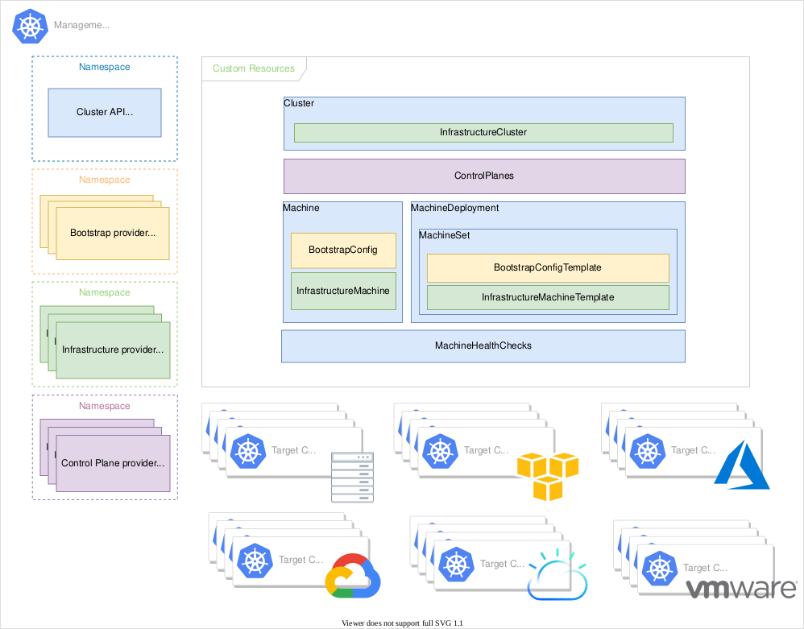

## TOC
### Me
### Security on Kubernetes
### Machine Learning Tools
### Kubernetes Cluster Deployment
### Organisational Matters

# Me in 5 Minutes

### When i am not working or sleeping
- Martial Arts
  - Karate
  - Recently Kickboxing
- Miniature Wargaming (i really like terrain building)
- Computers

## Previously...
### Education
- Chemistry
  - Reproducibility, Safety, Efficiency, Documentation

- Mostly Self Educated in Computers
  - Free Software Advocate

### Work
- Linux / Network Administrator
- System Architect
- Cloud Architect

## Assumptions and Context
- The security suggestions made in this presentation are not a complete laundry list to start handling patient data, but rather low hanging fruits that will be beneficial no matter what 
  - Your compliance framework of choice will inform your decisions beyond that
- The underlying VMware cluster is as secure as we need it to be
- There is a team of ML-practitioners in need of infrastructure who are currently sitting on their hands doing nothing
- I look at things from an infrastructure perspective

# Security

## User Wrangling

### Separation of Users and Environments
- Enforce resource requests and limits on a namespace and pod basis using policies (prevent noisy neighbour problems)
- Separate clusters for separate environments / users / purposes
  - Separate `prod` from `staging` and from `dev`
- All of this lowers the likelihood of misconfigurations affecting productive services

### Identity Management
- Use frequently expired credentials for administration
  - e.g. short term OIDC tokens via keycloak or another OIDC provider
- Use MFA  
- Both decrease the likelihood of exploitation in case of compromise

## User Wrangling - RBAC
- Differentiate service administrators from cluster administrators
  - In terms of scope, API objects and actions they may enact upon them
  - This limits the circle of people whose credentials can cause catastrophic damage, when stolen or mishandled
- Cluster administrators do not need full cluster admin permissions for everyday tasks
  - Grant a limited subset of cluster admin privileges with the possiblity of impersonating a more powerful role for special cases
  - Makes unfortunate accidents less likely

## Monitoring

### Central Logging
- Centralize Logs and Performance Metrics using LG(T)M stack
- Essential for discovering performance problems and debugging
- Alerting allows faster response to issues as they unfold

### Security Monitoring
- Monitor hosts and workloads for suspicious behaviour using e.g. Falco
  - If someone starts unusual processes or syscalls on your nodes and containers, **you** want to know
- Integrate monoitoring and alertig setup with the infrastructure of your SOC
  - If someone starts unusual processes or syscalls on your nodes and containers, **the SOC also** wants to know

## Network Hardening
### Network Policies
- Deny all Network traffic by default (can be achieved with e.g. Istio or Cilium CNI, most others as well)
- Administrators write Network Policies that only grant access to strictly necessary endpoints
  - This restricts an attacker's opportunities for lateral movement

### Traffic Encryption
- The infrastructure over which K8s services communicate across nodes may or may not be trustworthy
- Not all applications offer traffic encryption out of the box
- Istio Ambient Mode allows encrypting all inter node traffic with little overhead

## Policy Management

### Why all the fuss?
- Whenever you or any other actor creates an API object, a policy management tool can reject or modify that object to conform with policies you define
  - This prevents bad practices from creeping in (handing out generous permissions, not limiting pod resources, unfulfillable disruption budgets, ...)
  - Can also be used when e.g. an operator creates resources in a way that conflicts with your ideas

### Gatekeeper
- Policies are written in rego, a language specifically created for this purpose
- Make use of community provided Gatekeeper policies

### Kyverno
- Policies in plain YAML
- Kyverno also provides many community maintained policies

**Conclusion:** Unless the capabilities provided by rego are worth learning it to you, use Kyverno

## Workload Security
- Check running workload images for CVEs using e.g. `trivy-operator`
  - Gives an overview over neglected services and allows searching for specific CVEs 
- Scan Images for CVEs during CI using e.g. `trivy`
- Require usage of signed images using your policy management (at least for core services)

## Hardening of K8s Nodes
- Remove all unnecessary binaries and services
- Restrict container processes using AppArmor / SELinux
- No need to provide tools and opportunities for attackers who successfully compromised a node

# Machine Learning Tool Selection

## Selection of ML-Tools - MLFlow
### Upsides
- User friendly tracking and sharing of experiments and artifacts
- Comparatively simple
- Package models into container images

### Downsides
- Not K8s native
- Community Helmchart has been abandoned, a Bitnami Helmchart exists...

## Selection of ML-Tools - Kubeflow

#### Upsides
- K8s native
- No Community Helmchart yet, but recently there have been several efforts towards a standardised deployment
- Better Pipeline handling
- Jupyter Notebooks
- Advanced Features such as automated training and parameter fine tuning
- Supports Serving of ML models
- Scales well

### Downsides
- Complex
- Comes with heavy handed dependencies that some may not like
- Want to deploy it? Build your own helmchart from manifests or pay up for various vendor specific environments

## Selection of ML-Tools - Conclusion

- Writing a Helm Chart for your own use is not the worst idea
  - It may take longer to deploy, but it will benefit understanding of the software; this obviously pays off once things need to be adjusted or problems occur
- MLFlow is easier to start out with, Kubeflow has more advanced features you may want later
- MLFlow and Kubeflow can complement each other, because they have different strong points
  - I am already familiar with all of the external dependencies Kubeflow relies on, so that is less of an issue

## Microservice Deployment

### GitOps
- Deploy all Kubernetes resources using a declarative GitOps tool, Flux and Argo CD are popular choices
  - Main company behind Flux the project recently went bankrupt
  - ArgoCD supports multi tenancy (i choose ArgoCD here, because it's a dependency for KubeFlow)
- Git commits serve as documentation for changes
- Rollbacks are simple (in stateless applications)

### Kubernetes Deployment
- We want to deploy Kubernetes in a way that makes provisioning, scaling and upgrades as hassle free and reproducible as possible
  - Self healing, declarative infrastructure, rolling updates, ...
  - What Kubernetes does, but for Kubernetes nodes rather than containers
- `Cluster API` is the tool of choice for this, let's take a look at its inner workings

## Cluster-API architecture

## Demo Time!

## Organisation

### Determining fitting requirements for the problem

- Survey future users
- Review existing literature and other sources (Slack Channels, Mailing Lists, Conferences, ...) 
- Consult with experts (free software people are usually helpful)

### How will missing and or inadequate information be handled

- Involve Stakeholders in the platform development process
- Gather feedback in regular intervals
- Adopt an iterative approach, i.e. deliver a POC quickly for testing by key users
  - DevOps, basically

## Testing Concept

- The Proof of Concept should consist out of a Kubernetes cluster with:
  - ArgoCD, MLFlow, basic network rules and Gatekeeper + Policies from the community library to ensure best practices
- This initial setup can be used by ML-practitioners to familiarise themselves with the environment and provide feedback
  - KubeFlow as well as improved security and monitoring can be setup during this
- Adequate time should be allotted to improve upon this first iteration, certainly before end customers get involved
- Since we have separate dev and staging environments, engineers can freely test new changes on dev, without impacting production or staging

## How will unforeseen scaling requirements be handled after the system is already being used?
- Since we are using Cluster-API, scaling is very easily achieved
  - Scale up / down as necessary using  Kubernetes Cluster Autoscaler, allowing overprovisioning in VMware
- If Broadcomm decides to add *another* zero to VMware license fees, or we run out of hardware / space to put it, we can switch out `CAPV` with the equivalent for our private / public cloud provider of choice

## Literature and Links
- https://github.com/cncf/tag-security/blob/main/security-whitepaper/v2/cloud-native-security-whitepaper.md
- https://open-policy-agent.github.io/gatekeeper-library/website/validation/block-nodeport-services
- https://kyverno.io/policies/best-practices/restrict-node-port/restrict-node-port/
- https://github.com/kubernetes-sigs/cluster-api
- https://github.com/derailed/k9s
- https://github.com/helm/helm
- https://github.com/kubeflow/kubeflow
- https://github.com/mlflow/mlflow
- https://github.com/hetznercloud/hcloud-cloud-controller-manager
- https://github.com/cilium/cilium
- https://github.com/istio/istio
- https://github.com/Atomsoldat/presentations/

